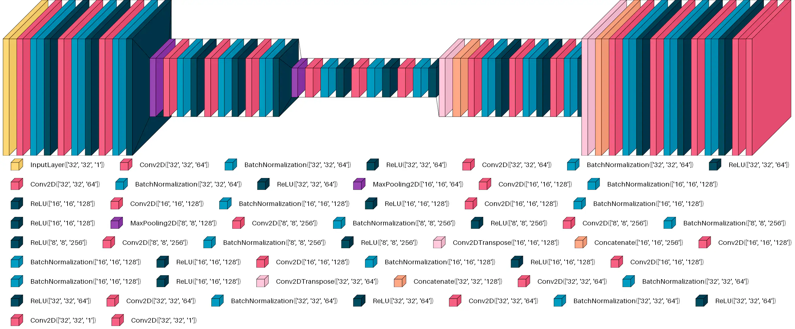

# blind-source-separation

Project realized for [Deep Learning (91250)](https://www.unibo.it/it/studiare/dottorati-master-specializzazioni-e-altra-formazione/insegnamenti/insegnamento/2024/493201) university course [@unibo](https://www.unibo.it/it).

## Blind Source Separation (BSS)

This project aims to separate an image, formed as the sum of two images, into its original components.
The two source images are drawn from different datasets: MNIST and Fashion-MNIST, respectively. No preprocessing is allowed. The neural network receives the combined image as input and outputs the predicted components. Both datasets (MNIST and Fashion-MNIST) are grayscale. All samples are padded to a (32,32) resolution.

Performance is evaluated using the Mean Squared Error (MSE) between the predicted and ground-truth images.

## Model

The model implemented is inpsired by [U-Net](https://arxiv.org/abs/1505.04597) architecture. It uses 3 encoder/decoder blocks connected by skip-connections. Each blocks contains 3 convolutions and batch normalizations activated by ReLU. There are 64 initial filters, they are doubled after each encoder block and halved after each decoder block.

There are 3,033,346 (11.57 MB) parameters in total.

Training lasted 69 epochs with 1687 steps per epoch and batch size equal to 32. It took ~1h 20m on Google Colab T4 GPU free-tier.

## Results

The model is tested using a generator initialized with 5000 samples from the test set. Result scores are obtained averaging 10 test rounds, 50000 predictions in total.

- The average **mse** is: **0.000388121648599426**
- The **standard deviation** between rounds is: **7.954220393637751e-06**

### Some predictions example

